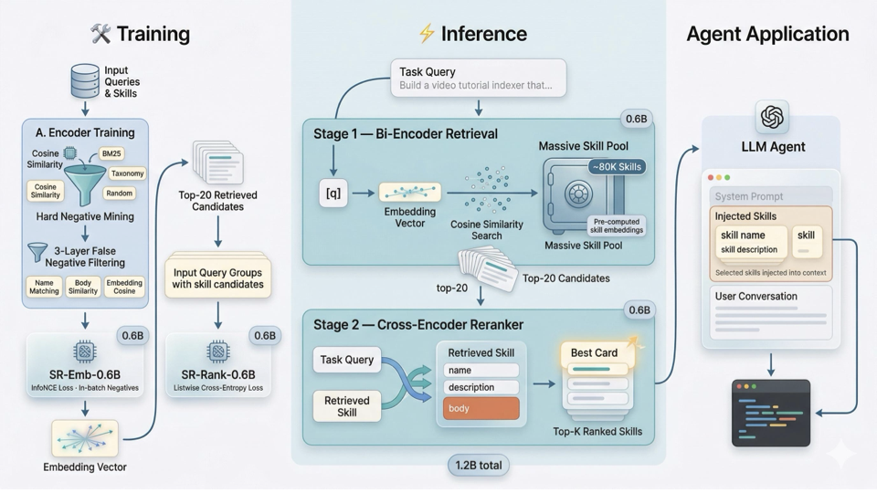

# SkillRouter

<p align="center">
  <strong>Skill Routing for LLM agents at ~80K scale.</strong><br/>
  Public release with benchmark data, evaluation scripts, and open 0.6B models.
</p>

<p align="center">
  
</p>

SkillRouter is a practical retrieval system for large skill registries, where many skills look similar at the metadata level but differ in their actual implementation. This repository packages the public evaluation release: the benchmark, the released 0.6B models, and evaluation scripts for reproducing the retrieve-and-rerank pipeline on your own machine.

## Why SkillRouter

Current agent systems usually expose only skill names and descriptions during selection. Our central finding is that this is not enough: the full skill body is the decisive routing signal in large, highly overlapping skill pools.

| At a glance | Value |
| --- | --- |
| Candidate pool | ~80K open-source skills |
| Evaluation set | 75 expert-verified queries |
| Primary compact system | 0.6B encoder + 0.6B reranker |
| Main result | 74.0% average Hit@1 |
| Deployment target | Consumer hardware / local inference |

## Released Models
🎉 2K+ milestone reached: 2K / 10K downloads  [██░░░░░░░░]

| Model | Role | Link |
| --- | --- | --- |
| `SkillRouter-Embedding-0.6B` | First-stage retrieval over the full skill pool | [pipizhao/SkillRouter-Embedding-0.6B](https://huggingface.co/pipizhao/SkillRouter-Embedding-0.6B) |
| `SkillRouter-Reranker-0.6B` | Top-20 reranking with full skill text | [pipizhao/SkillRouter-Reranker-0.6B](https://huggingface.co/pipizhao/SkillRouter-Reranker-0.6B) |

## Quick Start

### Installation

```bash
python3 -m venv .venv
source .venv/bin/activate
pip install -r requirements.txt
```

The scripts assume a CUDA-capable local machine. For larger runs, set `CUDA_VISIBLE_DEVICES` before invoking the shell wrappers.

### Download Evaluation Data

The large benchmark skill-pool shards are hosted on Hugging Face Datasets instead of Git LFS:

```bash
bash scripts/download_eval_data.sh
```

This restores `data/eval_core/easy/` and `data/eval_core/hard/` from [pipizhao/SkillRouter-Eval-Core](https://huggingface.co/datasets/pipizhao/SkillRouter-Eval-Core).

### One-Command Evaluation

```bash
bash scripts/evaluate_open_models.sh
```

or:

```bash
make eval-open-models
```

This runs the released 0.6B embedding model plus the released 0.6B reranker over the `easy` and `hard` benchmark tiers and writes:

- retrieval outputs to `outputs/open_model_eval/retrieval/`
- reranked outputs to `outputs/open_model_eval/reranked/`
- summary metrics to `outputs/open_model_eval/summary.json`

If you want to use local checkpoints instead of the default Hugging Face repo IDs:

```bash
SKILLROUTER_EMB_MODEL_OR_PATH=/path/to/SkillRouter-Embedding-0.6B \
SKILLROUTER_RERANK_MODEL_OR_PATH=/path/to/SkillRouter-Reranker-0.6B \
bash scripts/evaluate_open_models.sh
```

## Evaluate a Custom Model

### Retrieval Only

1. Export predictions:

```bash
python3 -m src.export_retrieval \
  --encoder_model_or_path /path/to/your/encoder \
  --data_root data/eval_core \
  --output_dir outputs/custom_eval \
  --tiers easy hard
```

The default export keeps top-50 candidates.

2. Score one tier:

```bash
bash scripts/evaluate_predictions.sh \
  --predictions outputs/custom_eval/retrieval/easy.json \
  --tier easy
```

### Retrieval + Rerank Pipeline

```bash
python3 -m src.run_open_model_eval \
  --data_root data/eval_core \
  --encoder_model_or_path /path/to/your/encoder \
  --reranker_model_or_path /path/to/your/reranker \
  --tiers easy hard \
  --output_dir outputs/custom_pipeline_eval
```

The default pipeline reranks the top-20 retrieval candidates with `flat-full` prompts.

## Benchmark and Data

The evaluation benchmark is hosted on Hugging Face Datasets to avoid relying on Git LFS bandwidth:

- [pipizhao/SkillRouter-Eval-Core](https://huggingface.co/datasets/pipizhao/SkillRouter-Eval-Core)

Download it into the layout expected by the scripts:

```bash
bash scripts/download_eval_data.sh
```

This repository keeps the lightweight metadata files in `data/eval_core/` and downloads the large `jsonl.gz` skill-pool shards on demand. All evaluation code in [src/](src/) accepts either a single JSONL file or a directory of `jsonl` or `jsonl.gz` shards.

- [Evaluation benchmark](data/eval_core/README.md): benchmark tasks, graded relevance labels, and the two benchmark tiers.
- [Evaluation protocol](evaluation/README.md): prediction format and metric definitions.

For the released benchmark:

- use `tasks.jsonl` as the query set
- use `relevance.json` as ground truth and graded relevance
- skip `generic_only` tasks during scoring
- report predictions as a JSON map from `task_id` to ranked `skill_id` list

## Repository Layout

```text
.
├── README.md
├── assets/
│   └── readme/
├── data/
│   └── eval_core/
├── evaluation/
├── manifests/
├── scripts/
└── src/
```

## Data Sources and Attribution

The public evaluation release in this repository builds on upstream open-source resources. Please also acknowledge the original data sources when using the benchmark:

- Ground-truth queries and ground-truth skills for evaluation are derived from [benchflow-ai/skillsbench](https://github.com/benchflow-ai/skillsbench).
- The benchmark skill pool is derived from [majiayu000/claude-skill-registry](https://github.com/majiayu000/claude-skill-registry).

## Paper and Citation

Paper: [SkillRouter: Skill Routing for LLM Agents at Scale](https://arxiv.org/abs/2603.22455)

If you use this repository, benchmark, or released models in your work, please cite:

```bibtex
@misc{zheng2026skillrouterskillroutingllm,
      title={SkillRouter: Skill Routing for LLM Agents at Scale}, 
      author={YanZhao Zheng and ZhenTao Zhang and Chao Ma and YuanQiang Yu and JiHuai Zhu and Yong Wu and Tianze Xu and Baohua Dong and Hangcheng Zhu and Ruohui Huang and Gang Yu},
      year={2026},
      eprint={2603.22455},
      archivePrefix={arXiv},
      primaryClass={cs.LG},
      url={https://arxiv.org/abs/2603.22455}, 
}
```
